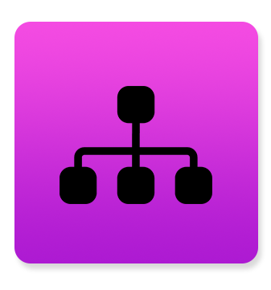
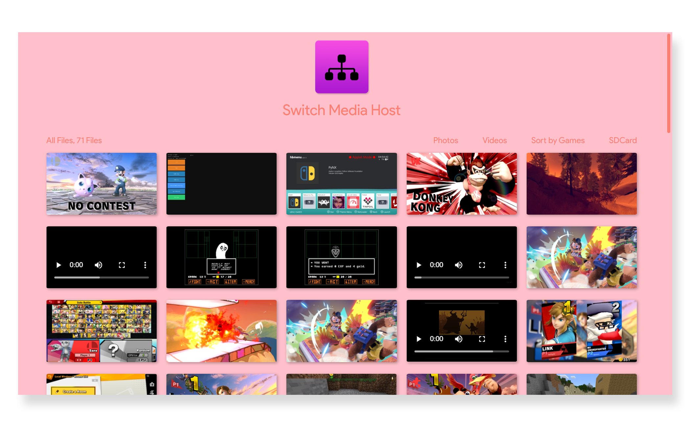
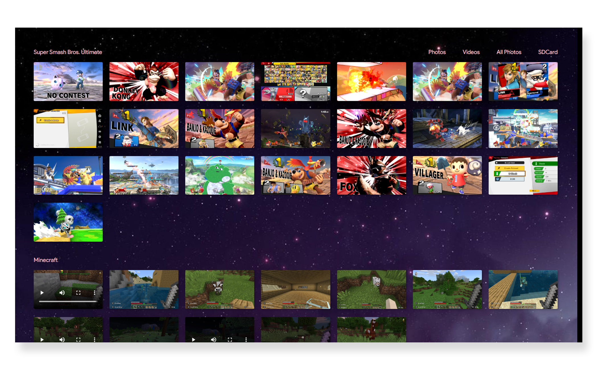
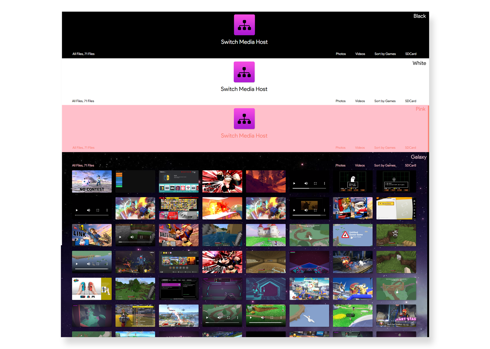

 Host your Switch media over LAN.    Screenshots Videos And SDCard Contents

##

<i>Switch Media Host</i> is a simple python script that allows you to see your Switch screenshots, video clips, and all of your SDCard contents directly from your browser! <b>Note: You need to be on the same network as the Switch in order to see your files. </b> This allows for easier transfering, with a simple and clean design.   It achieves this by hosting a local webserver directly from the Switch, and then the script adjusts the webpage to fit your system accordingly!  Your Switch must have access to homebrew.

## Features

View Screenshots, Video clips, and SDCard content

Organize files by file type and game

Simple Custom Themes
<a style="font-size: 8px;" href="#themes">Learn more
</a> 

## How to download and install

1.) Go to the <a href="https://github.com/ImmaSpoon/Switch-Media-Host/releases">releases</a> page and download the latest release  2.) Make sure you have the latest <a href="https://github.com/nx-python/PyNX/releases">PyNX</a>  3.)Extract all of the zips into the root of the SDCard

## How to use

1.) Once you have everything installed, turn on your Switch and open PyNX from the Homebrew menu  2.) Open 'Switch Media Host.py'  <a style="font-size: 8px;"> Rename this file to 'main.py' to have it launch instantly</a>  3.) Give it a few seconds to load  4.) Go to the URL printed on the Switch, and you're done!

## Themes

A theme is very easy to make. To find your themes, go into the Config.ini file found in the SwitchMediaHost folder. At the very bottom of this file, you can see your themes. A theme looks like this:  black = black, white, lightgrey, black, icon.png, Switch Media Host  (Background color, Font color, Hover text color, Scroll bar color <a style="font-size: 8px;">(works best in chrome)</a>, Main logo <a style="font-size: 8px;">(optional)</a>, Title of page <a style="font-size: 8px;">(optional)</a>, Background Image <a style="font-size: 8px;">(optional)</a>)  You can use HTML color codes as well
 <a style="font-size: 10px;">Note: The scroll bar has issues with the background image, HTML issue</a>

## Useful links

<a href="https://github.com/ImmaSpoon/Switch-Media-Host/releases">Switch Media Host Latest</a>  <a href="https://github.com/nx-python/PyNX/releases">PyNX Latest</a>  <a href="https://switch.homebrew.guide/">Getting started with Homebrew</a>  

